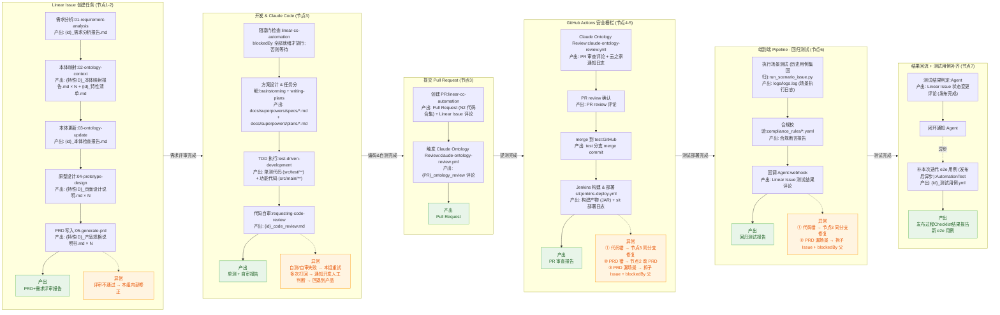
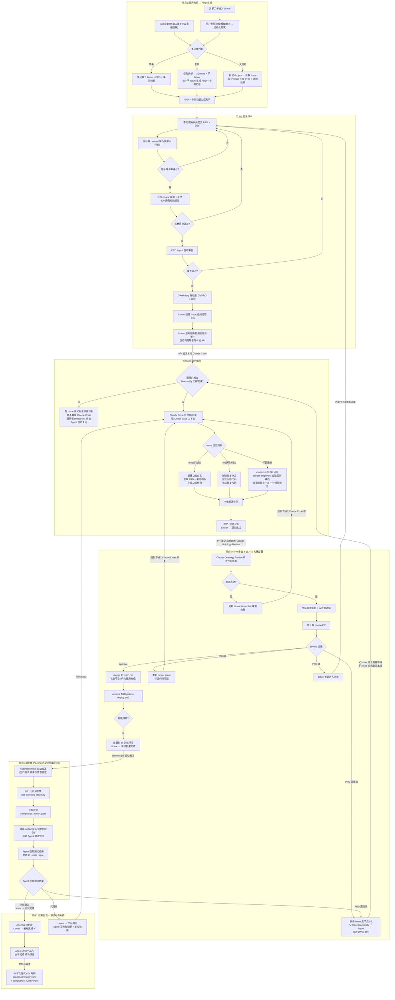

# AI 全链路工作流

## **完整协同链路总览**

> 每个大组 = 一个阶段,组内是**关键节点流程**(纵向串联),每个节点 2 行:**第 1 行** = 标题:skill/workflow 名;**第 2 行** = `产出: 代码 / 文档 / 日志`。每个大组末尾挂两个汇总节点:**绿色 = 整体产出(给下游)**;**橙色 = 异常回转(失败时回到哪)**。大组之间的连线标注 Linear Issue 的状态流转。

**关键原则：**

**1、“本体即产品” 2、“测试即开发” 3、“文件即总线”**



**图例与规范:**

* 节点 2 行格式 = `标题:skill/workflow 名` + `产出: 代码 / 文档 / 日志`
* 产出严格为**可存档交付物**(代码文件、.md 文档、日志、PR/Issue 评论),不写"动作/状态"
* 标注 `(存档)` = 必须进入 Git 存档
* **每个大组末尾两个汇总节点**:
  * 🟢 **绿色(大组产出)** = 这个大组交给下游的整体产出(跨大组的交付物)
  * 🟠 **橙色(异常回转)** = 本大组异常时回转到哪里(虚线表示,不画到目的地的连线,避免主图拥挤)
* 大组之间的箭头标签 = Linear Issue 在该阶段之间的状态流转;无标签 = 状态不变
* Linear 状态流转:`提测完成`(N3 创建 PR 后 Linear ↔ GitHub 自动流转)→ `测试部署完成`(N4 Jenkins 部署 sit 完成后流转)→ `测试完成`(N5 回归通过后 Linear 自动流转)→ `发布完成`(N6 V1 最终判定成功后 Agent 回写);失败分支流转 `产研退回`
* **N2 入口阻塞门**:Linear 监听服务在指派事件触发本地 Claude Code 之前,先检查 Issue 的 `blockedBy` 列表,若存在未就绪的阻塞项(状态 < `测试部署完成`)则暂不触发,在 Issue 评论里标注等待对象;阻塞项 merge 进 test 后由 Agent 自动复活下游 Issue
* **N5 跑的是历史用例集做回归**,防止新代码破坏老功能;**本次 PR 新功能的 e2e 用例由 N6 V3 在发布后补齐**,供下次迭代回归用
* [`虚线箭头 = 异常回转 / 异步动作,不在主链路的实时流转里`](<https://github.com/invagent/fpy-ar-invoice-ontology/tree/impl/linear-cc-automation>)
* [`{id}` = 需求标识(对应 Linear Issue ID 或批次 ID);`{特性ID}` = 拆解后的子特性标识,每需求可对应多份(× N);`{PR}` = Pull Request 标识](<https://github.com/invagent/fpy-ar-invoice-ontology/tree/impl/linear-cc-automation>)
* [开发侧 skill 来自 ](<https://github.com/invagent/pr-workflows>)[obra/superpowers](<https://github.com/obra/superpowers>)(TDD 流程)+ 本项目 [impl/linear-cc-automation](<https://github.com/invagent/fpy-ar-invoice-ontology/tree/impl/linear-cc-automation>) 自动化编排
* GitHub workflow:`claude-ontology-review.yml`(PR 触发) / `jenkins-deploy.yml`(push test 触发) — 均调用 [invagent/pr-workflows](<https://github.com/invagent/pr-workflows>) 通用 workflow
* 端到端测试框架:`QualityAndSafetyDep/AutomationTest`(Python + YAML 驱动,Jenkinsfile 编排)
* **版本号规范**:Git 提交的文档 / 代码版本统一使用 `YYYYMMDD-NNN` 格式(年月日 + 三位序号)

---

## **完整流水线(7 个节点)**



### **节点 1:需求来源 → PRD 生成**

**来源 A:外部工单**

① 工单进入 Linear

② 用户意图理解(模糊需求 → 结构化需求)

③ 复杂度判断 → 按规模选择结构,每个 Issue 同步生成 PRD + 单测初版

**来源 B:内部规划**

① 李润成线下完成意图理解

② 复杂度判断 → 按规模选择结构,每个 Issue 同步生成 PRD + 单测初版

**复杂度判断规则:**

| 规模 | 结构 | 产出 |
| -- | -- | -- |
| 简单 | 单个 Issue | PRD + 单测初版 |
| 复杂 | 父 Issue + 子 Issue | 每个子 Issue 对应 PRD + 单测初版 |
| 大规划 | 新建 Project + Issue 拆解 | 每个 Issue 对应 PRD + 单测初版 |

**触发下一节点**:PRD + 单测初版生成完毕 → 李润成确认并提交 → 进入需求评审

### **节点 2:需求评审**

① 李润成确认并提交 PRD + 单测

② 陈于辉从技术可行性角度 review PRD → 不通过:回到①重新修改提交

③ 陈于辉评审通过 → 长林从测试角度 review 单测用例,同步输出端到端测试用例和数据集 → 不通过:回到①重新修改提交

④ 长林评审通过 → PRD Agent 自动审查 → 不通过:回到①重新修改提交

⑤ 审查通过 → OAuth App 将 PRD + 单测存档到 Git

⑥ Linear 创建 Issue,指派给陈于辉

⑦ Linear 监听服务检测到指派事件,自动调用陈于辉本地 API

**触发下一节点**:API 自动触发陈于辉本地 Claude Code 启动

### **节点 3:自动化编码**

基于 [superpowers](<https://github.com/obra/superpowers>) TDD 流程 + 本项目 [linear-cc-automation](<https://github.com/invagent/fpy-ar-invoice-ontology/tree/impl/linear-cc-automation>) 自动化编排。**核心原则:单测优先,TDD 驱动**(符合 4/27 产研流程规划的结论)。

**前置(由 linear-cc-automation 完成,无独立交付物)**:Linear webhook 触发 → **阻塞门检查** → 分配 git worktree → 拉取 Linear Issue 上下文(PRD、单测初版、标签)。

* **阻塞门**:在分配 worktree 之前,Linear 监听服务读取本 Issue 的 `blockedBy` 列表
  * `blockedBy` 为空,或所有阻塞 Issue 状态 ≥ `测试部署完成` → 放行,继续走 TDD 流程
  * 存在未就绪的阻塞项 → 暂不触发 Claude Code,在 Issue 评论里标注"等待 {阻塞 Issue ID} 合入 test 后自动恢复"
  * 阻塞项 merge 进 test 后,Agent 检测到状态变化,主动重新派单本 Issue,Linear 监听服务再次进入阻塞门(此时通过)→ 触发 Claude Code 走"打回重做"路径

① **方案设计 & 任务分解**(`brainstorming` + `writing-plans`)

* 产出:`docs/superpowers/specs/{date}-{slug}.md`(设计文档) + `docs/superpowers/plans/{plan}.md`(任务分解,2-5 分钟/步)

② **TDD 执行**(`test-driven-development`):严格执行 RED → GREEN → REFACTOR

* 产出:单测代码(`src/test/**/*Test.java`)+ 功能代码(`src/main/**/*.java`)
* **先写失败的单元测试**(单测优先),观察失败 → 写最小实现 → 观察通过 → 重构,每个循环提交

③ **代码自审**(`requesting-code-review`)

* 产出:`{id}_code_review.md`(按严重度分级的问题清单,关键问题阻塞进度)

[**Issue 类型分支:**](<https://github.com/invagent/fpy-ar-invoice-ontology/tree/chen-yuhui/cnprd-314>)

| 类型 | 分支策略 | 入口动作 |
| -- | -- | -- |
| feat(新功能) | 新建功能分支 | 读取 PRD + 单测初版,生成功能代码 |
| fix(缺陷修复) | 新建修复分支 | 定位问题代码,生成修复代码 |
| **打回重做** | **checkout 原 PR 分支 +** `rebase origin/test` | 拉取最新基线(可能含上游子 Issue 已合入的写入逻辑),读取失败上下文,针对性修复 |

**后置(由 linear-cc-automation 完成)**:验证全量测试通过,推送分支 → 进入 N3。

**参考实现**:[chen-yuhui/cnprd-314](<https://github.com/invagent/fpy-ar-invoice-ontology/tree/chen-yuhui/cnprd-314>) 为 [CNPRD-314](https://linear.app/invagent/issue/CNPRD-314/f-i-d04-增值税合规校验成品油扩展) 的自动化产出分支

**触发下一节点**:PR 创建 → Linear 自动流转 `提测完成` → 进入节点 4

### **节点 4:GitHub Actions 安全栅栏(PR 审查 + 合并 + 构建部署)**

**对应大组 N4,涵盖 Linear 的节点4-5 阶段。** 进入本节点时 Linear Issue 状态已流转到 `提测完成`,Jenkins 部署 sit 成功后流转到 `测试部署完成`。

① **Claude Ontology Review**

* workflow:`.github/workflows/claude-ontology-review.yml`(上游 `invagent/pr-workflows`)
* 产出:PR 审查评论(本体合规 + 代码质量)+ 云之家通知日志
* 结果走向:
  * 通过 → 进入 PR review 确认
  * 失败 → 更新 Linear Issue 标记审查失败,回到节点3 由 Claude Code 修复

② **PR review 确认**(陈于辉)

* 产出:PR review 评论(approve / 打回重做)

| 结果 | 处理 | 失败归因 |
| -- | -- | -- |
| approve | merge 到 test 分支 | — |
| **代码错**(实现偏差、bug) | 回到节点3,Claude Code 同分支修复 | 实现层 |
| **PRD 错**(规则定义有误、字段语义错) | Issue 重新进入评审(回节点2 改 PRD) | 设计层 |
| **PRD 漏场景**(规则缺前置数据、依赖未声明、边界场景缺失) | **拆子 Issue 走节点1-2;父 Issue** `blockedBy` **子 Issue,状态切** `产研退回`**,等子 Issue 合入 test 后由阻塞门自动复活** | 设计层(增量) |

> **三种失败归因的判定标准**:
>
> * **代码错** = PRD 描述了正确行为,代码没实现到 → 同分支修代码即可
> * **PRD 错** = PRD 描述了错误行为,代码忠实实现了错的 → 必须改 PRD,否则改完再评审仍是错
> * **PRD 漏场景** = PRD 描述的行为正确但不完整,补全需要新增数据流/接口/前置步骤,**这部分工作量在原 Issue 范围之外** → 必须拆子 Issue 单独走流水线,父 Issue 等子 Issue 合入后在新基线上接力

③ **merge 到 test 分支**

* 产出:test 分支 merge commit(代码)
* Linear 状态不变(自 N3 创建 PR 起保持 `提测完成`)

[④ **Jenkins 构建 & 部署 sit**](<../../../QualityAndSafetyDep/AutomationTest>)

* workflow:`.github/workflows/jenkins-deploy.yml`(push test 事件触发)
* 上游 workflow:`invagent/pr-workflows/.github/workflows/jenkins-deploy.yml@master`
* 参数:`service=fpy-ar-invoice-ontology`, `branch=test`, `deploy=true`
* 产出:Jenkins 构建产物(JAR) + sit 部署日志 + 云之家通知
* 部署成功 → Linear 流转 `测试部署完成`

**触发下一节点**:sit 部署成功后,`autotest` job 自动触发端到端测试

### **节点 5:端到端 Pipeline · 回归测试(AutomationTest)**

基于 [`QualityAndSafetyDep/AutomationTest`](<../../../QualityAndSafetyDep/AutomationTest>) 项目 — Python + YAML 驱动的端到端自动化测试框架,通过 `Jenkinsfile` 编排。

> **本节点定位:回归测试**。本节点跑的是**已有历史用例集**,用于防止本次 PR 代码破坏老功能。**本次需求的 e2e 用例不在此环节验证** — 新功能用例由测试侧在发布完成后(见节点7 V3)补齐到测试库,供下一次迭代回归使用。

**前置(由** `jenkins-autotest.yml` 完成):拉取 AutomationTest 代码,scp 同步到测试服务器 `172.31.36.53:/opt/AutomationTest`,安装依赖。默认触发参数 `run_mode=issue_invoice`, `issue_mode=smoke`, `issue_type=blue`。

① **执行场景测试(历史用例集回归)**

| 模式 | 入口脚本 | 场景范围 |
| -- | -- | -- |
| `smoke` | `run_smoke.py` | 收票冒烟 |
| `full` | `run_all.py` | 收票全量 |
| `scenario` | `run_scenario.py` | 单场景(收票) |
| `issue_invoice` | `run_scenario_issue.py` | 开票场景(含 `smoke/blue/red/all/scenario/debug` 子模式) |

* 产出:`logs/logs.log`(场景执行日志,归档到 Jenkins)

② **合规校验**

* 规则配置:`configs/compliance_rules/*.yaml`
* 场景定义:`scenarios/issue/`(开票) / `scenarios/receive/`(收票)
* 校验方式:YAML 显式声明的 `scenario_tag` + `rule` 匹配,通过 MCP(test-data-platform / invoice-query / excel-parser)查数据库状态做断言
* 产出:合规断言报告

③ **回调 Agent**

* webhook(李创提供)
* 产出:Linear Issue 测试结果评论

**失败归因(同节点4)**:

| 结果 | 处理 |
| -- | -- |
| 测试通过 | Linear 流转 `测试完成`,进入节点6 |
| **代码错** | Linear → `产研退回`,回节点3 同分支修复 |
| **PRD 漏场景** | 拆子 Issue 走节点1-2;父 Issue `blockedBy` 子 Issue,状态切 `产研退回` |

**触发下一节点**:Agent 回写测试结果 → 成功 Linear 流转 `测试完成` → 进入 N6 最终判定

### **节点 6:结果回流 + 测试用例补齐(节点7)**

**进入本节点时 Linear Issue 状态为** `测试完成`,V1 做最终判定决定进入 `发布完成` 或 `产研退回`。

**同步路径(Agent 自动完成):**

① **测试结果判定**(`Agent`)

* 产出:Linear Issue 状态变更评论
* 成功路径:状态从 `测试完成` 流转到 `发布完成`
* 失败路径:状态切到 `产研退回`

② **闭环通知**(`Agent`)

* 成功 → 在 Issue 评论里 `@产品方`(李润成)告知发布完成
* 失败 → 在 Issue 评论里写失败原因摘要 + 定位链接(logs.log / 具体断言 / 失败场景 YAML),方便下一轮快速诊断
* 产出:Linear 评论(成功通知 / 失败摘要)

**异步路径(发布后补齐):**

③ **补本次迭代 e2e 用例**(测试侧,发布后异步触发)

* 产出:`scenarios/issue/*.yaml` 新增(本次新功能的正向 / 异常场景)+ `configs/compliance_rules/*.yaml` 新增(新规则包)
* 语义:**本次需求的 e2e 用例沉淀到测试库,供下次迭代作为 N5 回归基线**
* 依赖输入:本次 PRD 的验收标准 + 已落地的功能代码

**失败路径补充**:

* Agent 重新打开 Linear Issue,重新指派给陈于辉
* Linear 监听服务自动触发 → 进入节点3 阻塞门 → 通过后 Claude Code 按打回重做模式修复

---

## **过程中拆子 Issue:阻塞门 + 接力开发**

> 本小节针对"原 Issue 评审已过、开发已开,过程中发现 PRD 漏场景"这一类异常,定义流水线如何分裂、依赖如何声明、父子 Issue 如何接力。**首个落地案例**:[CNPRD-314](<https://linear.app/invagent/issue/CNPRD-314>) ↔ [CNPRD-403](<https://linear.app/invagent/issue/CNPRD-403>)。

### 触发条件

节点4 PR review 或节点5 e2e 测试发现:PRD 描述的行为正确但**不完整**,补全需要新增数据流/接口/前置步骤,且**新增工作量在原 Issue 范围之外**。判定标准见节点4 表格。

### 处理流程

```
[父 Issue 进行中]
   │
   ├─ 节点4 / 节点5 失败,归因「PRD 漏场景」
   │
   ▼
[拆子 Issue]
   ├─ 子 Issue 从节点1 进入,完整走 PRD 生成 → 评审 → 编码 → PR → 部署
   ├─ 父 Issue 状态 → 产研退回
   └─ 父 Issue blockedBy: 子 Issue
   │
   ▼
[父 Issue 进入阻塞等待]
   ├─ Linear 监听服务在指派事件触发 Claude Code 之前,先查 blockedBy
   ├─ 子 Issue 状态 < 测试部署完成 → 不放行,在评论标注等待对象
   └─ 子 Issue merge 进 test → Agent 自动复活父 Issue(重新指派)
   │
   ▼
[父 Issue 接力开发]
   ├─ Claude Code 走"打回重做"路径
   ├─ checkout 原 PR 分支 + rebase origin/test(已含子 Issue 写入逻辑)
   └─ 在新基线上完成原 Issue 的剩余工作
```

### 关键约束

| 约束 | 说明 |
| -- | -- |
| 1 Issue : 1 分支 | 子 Issue 独立分支,父 Issue 保留原分支(rebase 后继续) |
| 父子 Issue 都走完整流水线 | 子 Issue 不能跳过节点1-2 直接进编码 |
| `blockedBy` 是显式契约 | Linear 原生关系,Agent / 监听服务可程序化判定 |
| 阻塞门由监听服务实现 | 不依赖人工守门,指派事件自动检查 |
| 父 Issue 复活必 rebase | 接力开发的前提是 test 已含子 Issue 成果,rebase 拉取最新基线 |

### 落地案例:[CNPRD-314](https://linear.app/invagent/issue/CNPRD-314/f-i-d04-增值税合规校验成品油扩展) ↔ [CNPRD-403](https://linear.app/invagent/issue/CNPRD-403/f-i-d04-sub-成品油校验前置数据获取企业资质缓存-oil-005-库存实时查询)

* [CNPRD-314](https://linear.app/invagent/issue/CNPRD-314/f-i-d04-增值税合规校验成品油扩展):F-I-D04 增值税合规校验(成品油扩展),含 OIL-005 库存校验
* [CNPRD-403](https://linear.app/invagent/issue/CNPRD-403/f-i-d04-sub-成品油校验前置数据获取企业资质缓存-oil-005-库存实时查询):成品油校验前置数据获取(企业资质缓存 + OIL-005 库存实时查询)
* 依赖关系:[CNPRD-314](https://linear.app/invagent/issue/CNPRD-314/f-i-d04-增值税合规校验成品油扩展) 的 OIL-005 **读取** `PetroleumInfo.InventoryItems`;[CNPRD-403](https://linear.app/invagent/issue/CNPRD-403/f-i-d04-sub-成品油校验前置数据获取企业资质缓存-oil-005-库存实时查询) 实现该字段的**写入**
* 当前状态:[CNPRD-314](https://linear.app/invagent/issue/CNPRD-314/f-i-d04-增值税合规校验成品油扩展) `blockedBy` [CNPRD-403](https://linear.app/invagent/issue/CNPRD-403/f-i-d04-sub-成品油校验前置数据获取企业资质缓存-oil-005-库存实时查询),等待 [CNPRD-403](https://linear.app/invagent/issue/CNPRD-403/f-i-d04-sub-成品油校验前置数据获取企业资质缓存-oil-005-库存实时查询) 走完整流水线 merge 进 test

---

## **核心设计原则**

1\. **Linear 是中枢**:所有状态流转、通知触发、进度回填都以 Linear 为中心

2\. **全程自动,关键决策保留确认**:PRD 评审和 PR approve 是仅有的两个确认节点,编码全程自动化;测试用例补齐是发布后的异步动作

3\. **自动判责,快速打回**:Claude Ontology Review 审查结果通知干系人;e2e 测试结果由 Agent 直接判断,失败按归因(代码错 / PRD 错 / PRD 漏场景)走不同回转路径

4\. **Git 是唯一存档**:PRD、单测用例、代码、e2e 用例全部存 Git,可追溯、可回滚

5\. **AI 贯穿全链路**:需求理解 → PRD 生成 → 代码生成 → PR 审查

6\. **e2e 双向循环**:N5 用历史用例做回归 → N6 补本次用例 → 下一次迭代 N5 自然把本次用例纳入回归基线

7\. **依赖显式化 + 阻塞门接力**:过程中发现的缺失场景拆子 Issue 走完整流水线,父 Issue 用 `blockedBy` 声明依赖,阻塞门 + rebase 保证接力开发的基线正确性